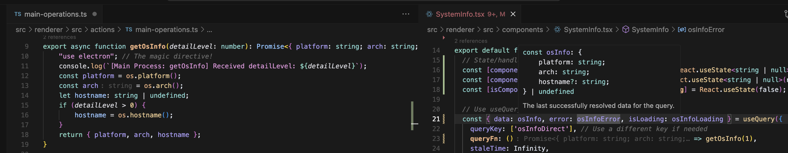
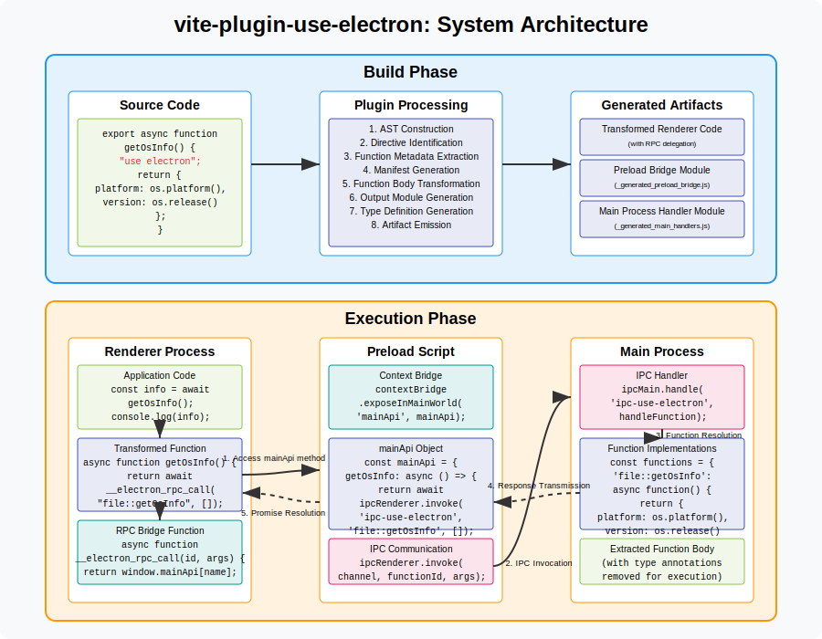
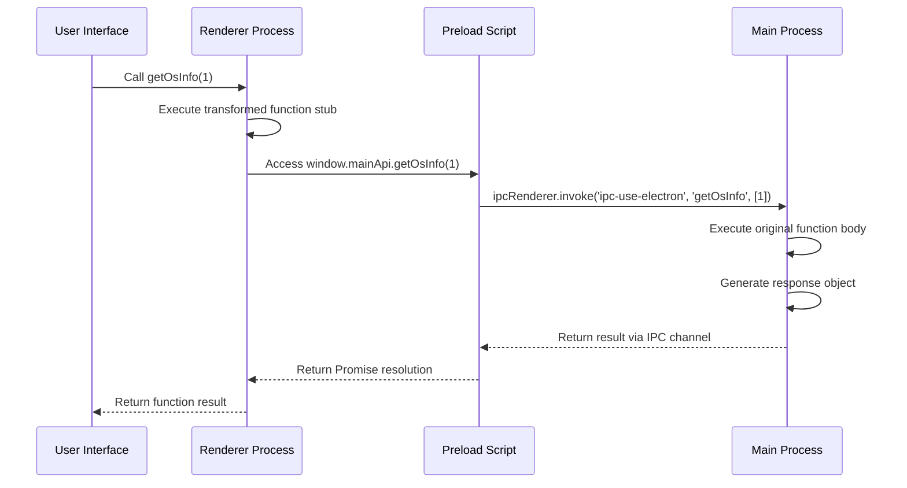
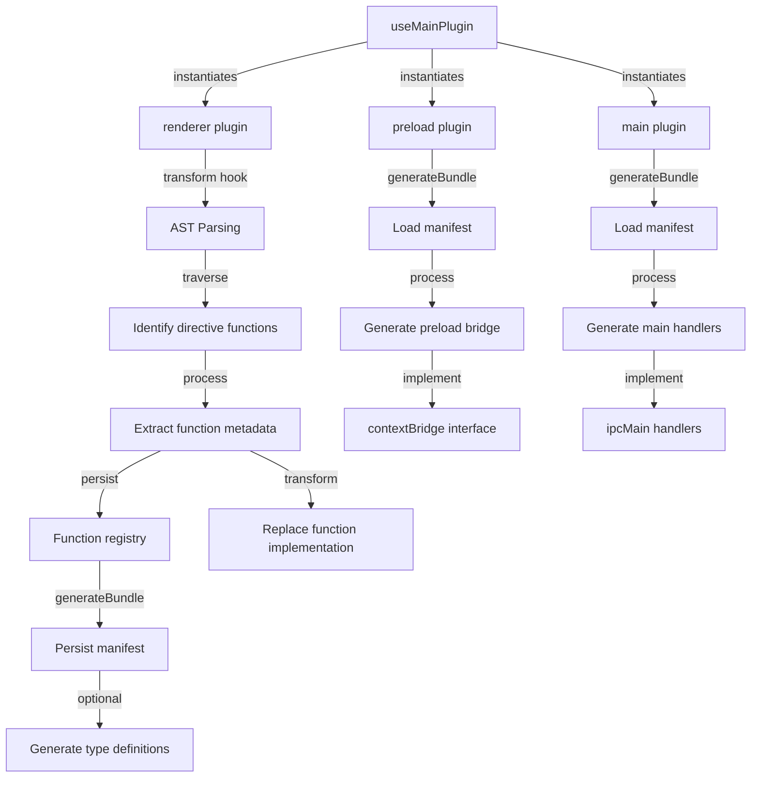
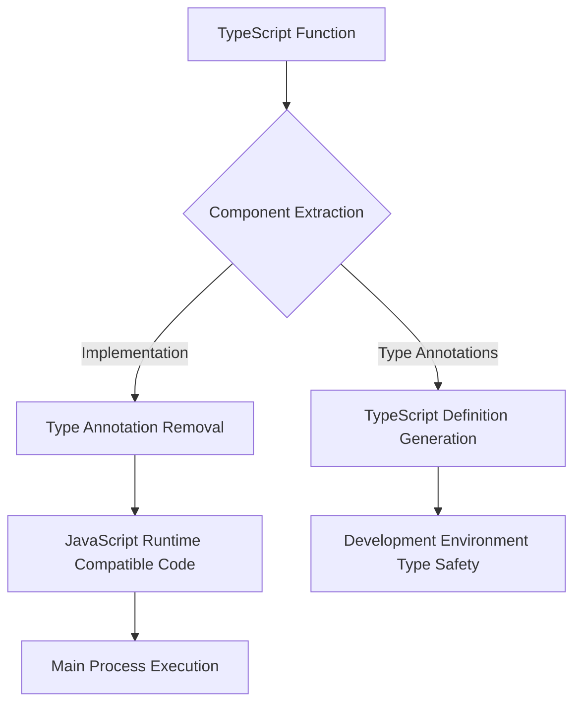
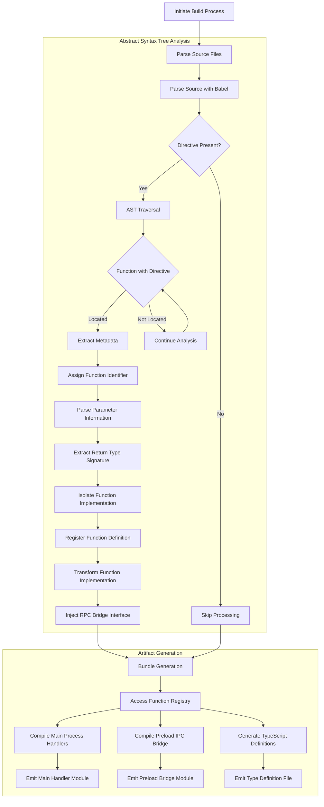

# vite-plugin-use-electron

A Vite plugin for RSC inspired communication between Electron's main and renderer processes using directives.




## Installation

```bash
npm install vite-plugin-use-electron --save-dev
```

## Features

- Seamlessly call Electron main process functions from the renderer process
- TypeScript support with automatic type generation
- Secure communication through Electron's contextBridge
- Simple directive-based API
- Works with Vite and Electron-Vite

## Usage

### Setup

1. Configure in your Vite config file:

```typescript
// vite.config.ts or electron.vite.config.ts
import { defineConfig } from 'vite'
import { useElectronMainPlugin } from 'vite-plugin-use-electron'

export default defineConfig({
  main: {
    plugins: [
      useElectronMainPlugin('main'),
      // other plugins...
    ]
  },
  preload: {
    plugins: [
      useElectronMainPlugin('preload'),
      // other plugins...
    ]
  },
  renderer: {
    plugins: [
      useElectronMainPlugin('renderer', {
        generateTypes: true // optional: generate TypeScript definitions
      }),
      // other plugins...
    ]
  }
})
```

2. Set up the main process handler in your main process entry file:

```typescript
// main/index.ts
import { app, BrowserWindow } from 'electron'
import { setupMainHandlers } from '../.vite-plugin-use-electron/_generated_main_handlers.js'

app.whenReady().then(() => {
  // Set up the IPC handlers
  setupMainHandlers()
  
  // Create window and other setup...
})
```

3. Ensure your preload script includes the bridge:

```typescript
// preload/index.ts
import '../.vite-plugin-use-electron/_generated_preload_bridge.js'
```

### Write main process functions

Create functions in your renderer code that will run in the main process:

```typescript
// renderer/src/YourComponent.tsx
function getSystemInfo() {
  "use electron" // This directive marks the function to run in main process
  
  const osInfo = require('os')
  return {
    platform: osInfo.platform(),
    arch: osInfo.arch(),
    cpus: osInfo.cpus().length,
    memory: osInfo.totalmem()
  }
}

// You can then call this function normally in your component:
const systemInfo = await getSystemInfo()
console.log(systemInfo.platform) // Logs the platform from the main process
```

## Options

The plugin accepts the following options:

```typescript
interface useElectronMainPluginOptions {
  // Generate TypeScript definitions (default: false)
  generateTypes?: boolean;
  
  // The directive keyword to use (default: 'use electron')
  directiveKeyword?: 'use electron' | 'use electron-main' | 'use main';
}
```

## License

MIT


# Technical Details

# vite-plugin-use-electron: Technical Overview

## Introduction

This document provides a technical overview of the vite-plugin-use-electron, a Vite plugin that facilitates inter-process communication in Electron applications through directive-based function execution.



## Problem Context

Electron applications operate within a multi-process architecture consisting of a main process with full Node.js capabilities and a renderer process with limited system access. Communication between these processes traditionally requires explicit inter-process communication (IPC) mechanisms, resulting in distributed implementation across multiple files and potential inconsistencies in type definitions.

## Technical Approach

The plugin operates by identifying functions marked with the directive `"use electron"`, extracting their implementation for execution in the main process, and replacing their renderer-side implementation with remote procedure call (RPC) stubs. This architecture enables a code structure where system-level functions appear to be defined in the renderer context but execute in the main process environment.

## Implementation

### Function Definition Syntax

The plugin identifies functions for interprocess execution through a string directive:

```typescript
export async function getOsInfo(detailLevel: number): Promise<{ platform: string; arch: string; hostname?: string }> {
    "use electron"; // Process directive
    const platform = os.platform();
    const arch = os.arch();
    let hostname: string | undefined;
    if (detailLevel > 0) {
        hostname = os.hostname();
    }
    return { platform, arch, hostname };
}
```

This syntactic approach integrates with existing JavaScript language features for function directives while maintaining compatibility with TypeScript type checking.

### Runtime Process Flow



## Technical Architecture

### Plugin Components



The plugin comprises multiple interoperating components that process source code and generate artifacts:

1. **AST Processing**: Babel is employed to parse source files, identify directive-annotated functions, and extract their metadata.

2. **Type Handling**: TypeScript type information is preserved during extraction but stripped from function bodies intended for main process execution.




3. **Function Transformation**: Original function bodies in renderer code are replaced with RPC stubs that delegate execution to the main process.

4. **Preload Bridge Generation**: A preload script is generated to create IPC bridges between the renderer and main processes.

5. **Main Handler Generation**: Main process handler code is generated to execute the original function bodies.

### Workflow Detail



The workflow consists of two primary phases:

1. **Build-time Processing**:
   - Source code is parsed using Babel to construct an Abstract Syntax Tree (AST)
   - Functions with `"use electron"` directives are identified
   - Function metadata and bodies are extracted and stored in a manifest
   - Function bodies in the renderer are replaced with RPC stubs
   - Type definitions, preload bridges, and main process handlers are generated

2. **Runtime Execution**:
   - When a transformed function is called in the renderer, the RPC stub is executed
   - The stub utilizes the preload bridge to communicate via IPC
   - The main process handler receives the call and executes the original function body
   - Results are returned via IPC to the renderer


## Configuration Options

The plugin provides configuration parameters that modify its behavior:

```typescript
interface UseMainPluginOptions {
  generateTypes?: boolean;  // Controls type definition file generation
  directiveKeyword?: 'use electron' | 'use electron-main' | 'use main'; // Specifies directive syntax
}
```

## Implementation Considerations

### Performance

The plugin architecture has been designed with the following performance characteristics:

1. **Build-time Processing**: Computational overhead is primarily incurred during the build phase rather than at runtime.

2. **Runtime Efficiency**: Generated IPC mechanisms employ minimal serialization and direct function dispatch.

3. **Caching**: Function metadata is cached in a manifest file to accelerate subsequent builds.

4. **Error Handling**: Robust error pathways ensure graceful degradation if execution issues occur.

### Security

The plugin implementation adheres to Electron's security model:

1. **Context Isolation**: All IPC communication occurs through the contextBridge API, maintaining process isolation.

2. **Preload Security**: Only explicitly defined functions are exposed to the renderer process.

3. **Parameter Validation**: Function parameters undergo validation before execution in the main process.

## Integration

The plugin is integrated into a Vite + Electron project as follows:

1. **Renderer Process Configuration**:
   ```javascript
   // vite.config.ts
   import { defineConfig } from 'vite';
   import { useMainPlugin } from 'vite-plugin-use-electron';

   export default defineConfig({
     plugins: [
       useMainPlugin('renderer', { generateTypes: true }),
     ],
   });
   ```

2. **Main Process Configuration**:
   ```javascript
   // vite.config.main.ts
   import { defineConfig } from 'vite';
   import { useMainPlugin } from 'vite-plugin-use-electron';

   export default defineConfig({
     plugins: [
       useMainPlugin('main'),
     ],
   });
   ```

3. **Preload Script Configuration**:
   ```javascript
   // vite.config.preload.ts
   import { defineConfig } from 'vite';
   import { useMainPlugin } from 'vite-plugin-use-electron';

   export default defineConfig({
     plugins: [
       useMainPlugin('preload'),
     ],
   });
   ```

4. **Main Process Integration**:
   ```javascript
   // main.js
   const { setupMainHandlers } = require('./_generated_main_handlers.js');
   
   app.whenReady().then(() => {
     setupMainHandlers();
     // Additional initialization
   });
   ```

5. **Preload Script Integration**:
   ```javascript
   // preload.js
   require('./_generated_preload_bridge.js');
   ```

## Practical Applications

The plugin facilitates efficient implementations of common Electron patterns:

1. **File System Operations**:
   ```typescript
   export async function saveFile(path: string, content: string): Promise<void> {
       "use electron";
       await fs.promises.writeFile(path, content);
   }
   ```

2. **System Information Retrieval**:
   ```typescript
   export async function getSystemInfo(): Promise<SystemInfo> {
       "use electron";
       return {
           platform: os.platform(),
           arch: os.arch(),
           cpus: os.cpus(),
           memory: os.totalmem(),
           hostname: os.hostname()
       };
   }
   ```

3. **Native Dialog Presentation**:
   ```typescript
   export async function showOpenDialog(options: OpenDialogOptions): Promise<string[]> {
       "use electron";
       const { canceled, filePaths } = await dialog.showOpenDialog(options);
       return canceled ? [] : filePaths;
   }
   ```

## Conclusion

The vite-plugin-use-electron plugin provides a systematic approach to Electron's inter-process communication requirements. By enabling the definition of main process functionality within renderer code context, it addresses architectural complexities inherent in Electron's process model. This directive-based pattern maintains type safety through TypeScript integration while automating the generation of necessary IPC infrastructure.

The implementation demonstrates how build-time code transformation can be leveraged to create abstractions that simplify development workflows without compromising the underlying security model or performance characteristics of Electron applications.